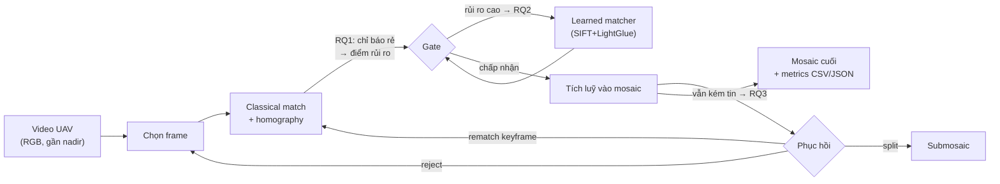

# Bức tranh tổng thể để chốt — dự án, RQ, dataset (2026-09-19)

**Mục đích:** tổng hợp một trang cho người dùng dễ quyết định (chốt dataset, xác nhận RQ). **Nguồn:** `STATUS.md`, `docs/logs/literature-survey/0002_novelty_audit_wave_2.md`, `docs/logs/datasets/0001_dataset_scan.md`. Không phải quyết định mới — là ảnh chụp để bàn luận.

## 1. Dự án đang làm gì

Xây **aerial mosaic 2D từ video UAV** bằng pipeline cổ điển, nhưng điểm khác biệt so với "chỉ ghép ảnh" là pipeline **biết khi nào đăng ký sắp hỏng và phản ứng với chi phí thấp**:

- Không georeference, không SLAM/3D, không bắt buộc GPS/IMU, không realtime.
- Hình thức: **NCKH + 1 MVP demo**, một codebase (pipeline = demo, eval harness = số liệu).
- Trạng thái: **chưa có code**; đang ở bước chốt RQ + dataset.

## 2. RQ ứng viên — cả ba tạm `narrow`

| RQ | Hỏi gì | Đã có (đe dọa novelty) | Khoảng trống sống sót |
|---|---|---|---|
| **RQ1 — Failure prediction** | Chỉ báo rẻ nào (inlier count/ratio, reproj error, overlap, spatial coverage) dự báo lỗi đăng ký và drift tích luỹ? | So sánh chỉ báo đã có ở VPR (Zaffar CVPR'24, Sferrazza CVPRW'25); heuristic vận hành trong UAV mosaicking (Li'23, Hwang'26) | Chưa ai đo **tiền cứu ở miền UAV** và liên kết tín hiệu cặp-frame → **drift cuối mosaic** |
| **RQ2 — Matcher routing** | Classical mặc định, chỉ gọi learned matcher khi rủi ro cao → trade-off quality–latency có thắng always-X? | Adaptive compute bên trong matcher (LightGlue'23); learned giá rẻ (XFeat ~27 FPS CPU, ETO) | Chưa thấy **routing cross-matcher** + đánh giá mosaic-level; rủi ro: always-learned giá rẻ có thể thắng → có kill-switch sẵn |
| **RQ3 — Recovery** | Khi vẫn kém tin: reject / rematch keyframe / split submosaic — cái nào giới hạn drift tốt nhất? | Từng hành động đã tồn tại: reject (Hwang'26), rematch (Li'23), split (DroneZaic'25) | Chưa ai so sánh 3 hành động **dưới một confidence trigger** trên cùng dữ liệu |
| RQ4 — Telemetry (GPS/yaw) | mở | — | chỉ kích hoạt nếu 3 cụm trên bị kill |

Ba RQ dùng chung pipeline + harness → hợp lệ thành bundle. Chưa đạt saturation (đợt 2 làm thu hẹp cả ba) → cần **đợt quét 3** trước khi khóa.

## 3. Dataset ứng viên — đã quét theo RDR-0002

| Dataset | Drone | Nội dung | Telemetry/GT | License | Truy cập | Vai trò đề xuất |
|---|---|---|---|---|---|---|
| **NPU Drone-Map** | Phantom3, hexacopter, Inspire | nhiều chuỗi 100+ GB (video, ảnh undistorted, keyframes) | **.SRT + gps.txt + GCP + trajectory + camera params** | không ghi | Baidu Pan (pwd công khai) | **Chính** — chạy cả 3 RQ; so được với Li'23 |
| **DroneZaic** | DJI (nông nghiệp) | raw videos 38 GB + processed 31 GB | telemetry kém (paper); code hỗ trợ .SRT | CC0 theo Dryad (chưa xác nhận trực tiếp) | tải thẳng Dryad | **Stress** repetitive texture |
| **Aerial234** | drone (SEU) | 234 ảnh, sinh ra để stitch 1 panorama khó | không | **cc-by-4.0** | gated HF (click-through) | **Challenge** đơn panorama |
| **WHU Aerial Video** | **DJI M300 RTK + P1** | 2 chuỗi video 60 fps 4K, GSD 3 cm | **RTK + 16 GCP (9 mm) + GT pose** | không ghi | không link tải hoạt động → email lab | **Đo drift tuyệt đối** |
| **UMCD** | drone thật, bay 6–15 m | 30 chuỗi mosaicking + 20 video geo, 3.5 GB | telemetry (độ cao/tốc độ/GPS) | "research only" | tải + mật khẩu email | Mosaicking-specific nhất (nếu chấp nhận mật khẩu) |
| ODMdata (helenenschacht, bellus…) | drone thật | bộ ảnh strip | EXIF GPS; vài tập **RTK/GCP** | theo từng repo | GitHub/Drive | Bổ trợ sai số tuyệt đối |

Đã loại: Mid-Air, MovingDrone, Blackbird (mô phỏng/tổng hợp); VisDrone/UDD (license không rõ/không phù hợp chính).

## 4. Cần chốt — 3 quyết định

1. **Cách đọc "opensource"** trong RDR-0002:
   - (a) Bắt buộc license chuẩn → chỉ còn Aerial234 (cc-by-4.0) + DroneZaic (nếu CC0 xác nhận).
   - (b) Tải được + dùng cho nghiên cứu → mở rộng cho NPU, WHU, UMCD.
2. **Kênh tải**: chấp nhận Baidu Pan (NPU) và mật khẩu/email (UMCD, WHU) không?
3. **Tổ hợp chọn**: khuyến nghị — **NPU (chính) + DroneZaic (stress) + Aerial234 (challenge) + WHU (drift/GT nếu xin được)**; UMCD thay NPU nếu muốn dataset chuyên mosaicking.

Sau khi chốt: ghi **RDR-0003** (dataset) → chạy đợt quét novelty 3 → đủ saturation thì **RDR-0004** khóa bộ RQ → viết experiment contract thành văn.
