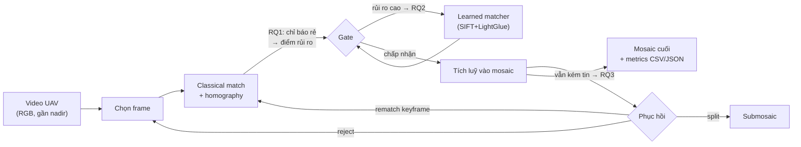

# Bức tranh tổng thể để chốt — dự án, RQ, dataset (2026-09-19)

**Mục đích:** tổng hợp một trang cho người dùng dễ quyết định (chốt dataset, xác nhận RQ). **Nguồn:** `STATUS.md`, `docs/logs/literature-survey/0002_novelty_audit_wave_2.md`, `docs/logs/literature-survey/0003_novelty_audit_wave_3.md`, `docs/logs/datasets/0001_dataset_scan.md`. Không phải quyết định mới — là ảnh chụp để bàn luận. Cập nhật sau đợt quét 3: 2026-09-19.

## 1. Dự án đang làm gì

Xây **aerial mosaic 2D từ video UAV** bằng pipeline cổ điển, nhưng điểm khác biệt so với "chỉ ghép ảnh" là pipeline **biết khi nào đăng ký sắp hỏng và phản ứng với chi phí thấp**:

- Không georeference, không SLAM/3D, không bắt buộc GPS/IMU, không realtime.
- Hình thức: **NCKH + 1 MVP demo**, một codebase (pipeline = demo, eval harness = số liệu).
- Trạng thái: **chưa có code**; đang ở bước chốt RQ + dataset.

## 2. RQ ứng viên — cả ba tạm `narrow`

| RQ | Hỏi gì | Đã có (đe dọa novelty) | Khoảng trống sống sót |
|---|---|---|---|
| **RQ1 — Failure prediction** | Chỉ báo rẻ nào (inlier count/ratio, reproj error, overlap, spatial coverage) dự báo lỗi đăng ký và drift tích luỹ? | So sánh chỉ báo đã có ở VPR (Zaffar CVPR'24, Sferrazza CVPRW'25); heuristic vận hành trong UAV mosaicking (Li'23, Hwang'26) | Chưa ai đo **tiền cứu ở miền UAV** và liên kết tín hiệu cặp-frame → **drift cuối mosaic** |
| **RQ2 — Matcher routing** | Classical mặc định, chỉ gọi learned matcher khi rủi ro cao → trade-off quality–latency có thắng always-X? | Adaptive compute bên trong matcher (LightGlue'23); learned giá rẻ (XFeat ~27 FPS CPU, ETO) | Chưa thấy **routing cross-matcher** + đánh giá mosaic-level; rủi ro: always-learned giá rẻ có thể thắng → có kill-switch sẵn |
| **RQ3 — Recovery** | Khi vẫn kém tin: reject / rematch keyframe / split submosaic — cái nào giới hạn drift tốt nhất? | Từng hành động đã tồn tại: reject (Hwang'26), rematch (Li'23), split (DroneZaic'25) | Chưa ai so sánh 3 hành động **dưới một confidence trigger** trên cùng dữ liệu |
| RQ4 — Telemetry (GPS/yaw) | mở | — | chỉ kích hoạt nếu 3 cụm trên bị kill |

Ba RQ dùng chung pipeline + harness → hợp lệ thành bundle. **Sau đợt quét 3:** không có công trình nào đổi keep/narrow/kill (đợt 2 đã thu hẹp cả ba; đợt 3 đứng yên). Theo chữ RDR-0001 cần hai vòng liên tiếp không đổi → còn thiếu **một vòng yên tĩnh nữa** (đợt 4 nhỏ) trước khi khóa, hoặc team quyết khóa luôn.

### RQ tùy chọn thêm — dẫn chứng trực tiếp từ 3 đợt survey (chưa audit kỹ cho riêng mình)

| Mã | Câu hỏi ứng viên | Bằng chứng từ survey | Ý nghĩa / điều kiện |
|---|---|---|---|
| **RQ4** | Ở mức nhiễu và dropout GPS/yaw nào thì telemetry tối thiểu còn cải thiện pipeline, từ khi nào thành có hại? | Đợt 1: IMU-stitching (arXiv 2025), UASTHN (2025) — fusion mở nhưng phải hỏi noise/dropout; dataset scan: NPU có .SRT + gps.txt, WHU có RTK | Metadata-assisted: bù xoay, dự báo overlap; cần dataset telemetry đồng bộ |
| **RQ5** | Cấu hình nào đạt budget latency/RAM trên CPU nhúng với chất lượng mosaic chấp nhận được? | Đợt 2: XFeat ~27 FPS CPU, ETO ~21 ms, và phát hiện "latency giữa paper không so sánh được (khác hardware/resolution)" → cần chuẩn đo cố định; đợt 1: Hwang 2026 pipeline thuần CPU | Kỹ thuật hệ thống sát ứng dụng; novelty thấp, giá trị thực dụng cao |
| **RQ6** | Failure-aware giữ bao nhiêu hiệu năng khi chuyển miền: đô thị ↔ cánh đồng lặp vân ↔ mặt nước vân thưa? | Đợt 2: Li 2023 báo lỗi ở mặt nước/vân thưa; Kim&Kim 2025 cứu low-texture bằng SIFT+LightGlue; Zaffar/Sferrazza chỉ ra chỉ báo nhạy domain; HEB khác miền UAV | Cross-domain; thực chất là biến thể RQ1 với trọng tâm generalization |
| **RQ7** | Chiến lược seamline + hoà trộn nào giảm artifact mức mosaic nhất ở góc gần nadir? | Đợt 1: Chen 2022 (optimal seam + half-projective), Implicit Neural Stitching (WACV 2024) — literature đông, đã hạ khỏi "đóng góp chính" | Khâu cuối dễ thấy bằng mắt; novelty yếu nhất |
| **RQ8** | Sai số đăng ký/drift ở mức nào bắt đầu làm hỏng phát hiện thay đổi giữa hai mosaic cùng tuyến bay? | Dataset scan: UMCD có 10 cặp video geo-referenced thiết kế riêng cho change detection; đợt 2: không ai có drift GT định lượng | Giám sát hiện trạng 2 thời điểm; tie-in với RQ1 (ngưỡng drift → ngưỡng an toàn) |
| **RQE** | Thiết kế protocol đo drift mức mosaic **không cần SLAM/BA** (dùng GCP/control points) và chuẩn hoá metric cho lĩnh vực? | Đợt 2: Li 2023 và Hwang 2026 đều không có drift định lượng; Kim&Kim đánh giá qualitative; dataset scan: NPU có GCP ở vài chuỗi, WHU có 16 GCP + GT pose | Đóng góp về phương pháp đánh giá — lấp lỗ hổng "đo thế nào" mà cả ba RQ kia đều cần |
| **RQS** | Chính sách chọn frame (sampling/keyframe) nào tối đa chất lượng-per-compute khi kết hợp với risk gate? | Đợt 1: adaptive frame selection bị kill làm đóng góp chính nhưng còn hook — Li 2023 (IoU gate chọn/reject), DroneZaic (sampling theo motion), Hwang 2026 (interval cố định); đợt 2: IoU mới là heuristic, chưa ai kiểm như predictor | Biến thể RQ1 ở cấp "chọn frame nào" thay vì "nhận frame nào" |

**Quy tắc chọn:** bộ RQ không cố định — chọn đúng **ba** RQ dùng chung một pipeline + một harness (ràng buộc từ RDR-0001 điều kiện 4). RQ1–RQ3 đã qua audit (narrow); RQ4–RQ8 + RQE + RQS chưa audit riêng — nếu được chọn thì chạy novelty audit cho RQ đó trước khi khóa (cơ chế "mở lại khảo sát" của RDR-0001). Gợi ý trộn: RQ1 + RQ2 + RQE (mọi novelty đều cần protocol đo drift), hoặc RQ1 + RQ3 + RQ8 (chuỗi "dự báo → phục hồi → ứng dụng").

### Bộ RQ gợi ý — các tổ hợp đi chung được với nhau

| Bộ | RQ thành phần | Câu chuyện đề tài | Audit sẵn | Dataset cần | Điểm yếu |
|---|---|---|---|---|---|
| **B-1 — Lõi Failure-Aware** | RQ1 + RQ2 + RQ3 | Pipeline biết dự báo lỗi → phân luồng matcher theo rủi ro → tự phục hồi khi hỏng | 3/3 (narrow) | NPU chính + DroneZaic stress | Vướng bài toán đo drift (phải tự xử lý, không có RQE trong bộ) |
| **B-2 — Lõi + Chuẩn đo** | RQ1 + RQ2 + RQE | Dự báo + phân luồng, kèm đóng góp protocol đo drift chuẩn cho cả lĩnh vực | 2/3 (RQE chưa) | NPU (có GCP ở vài chuỗi); WHU nếu xin được | Bỏ câu chuyện phục hồi; nhẹ hơn về implementation |
| **B-3 — Giám sát hiện trạng** | RQ1 + RQ3 + RQ8 | Ứng dụng thật: dự báo drift → phục hồi → ngưỡng an toàn cho change detection giữa 2 lượt bay | 2/3 (RQ8 chưa) | **UMCD** bắt buộc (10 cặp geo-referenced) | Phụ thuộc mật khẩu UMCD + research-only; RQ8 chưa audit |
| **B-4 — Hiện trường khắc nghiệt + metadata** | RQ1 + RQ3 + RQ4 | Failure-aware được telemetry hỗ trợ; đánh giá noise/dropout GPS-yaw tới đâu còn giúp | 2/3 (RQ4 chưa) | NPU bắt buộc (.SRT + gps.txt) | RQ4 phụ thuộc chất lượng telemetry của dataset |
| **B-5 — Kỹ thuật hệ thống cho drone thật** | RQ2 + RQ5 + RQE | Sản phẩm hóa: routing tiết kiệm compute, đạt budget nhúng, đo đúng — khớp mục tiêu drone cứu hộ/giám sát | 1/3 (RQ5, RQE chưa) | NPU + Aerial234 | Novelty học thuật thấp nhất; giá trị ứng dụng cao nhất |
| **B-6 — Khái quát hóa miền** | RQ6 + RQ2 + RQE | Policy routing giữ vững khi chuyển miền đô thị ↔ cánh đồng ↔ mặt nước, có chuẩn đo drift | 1/3 (RQ6, RQE chưa) | NPU (3 miền: village/highway/factory có nước) + DroneZaic | RQ6 là biến thể RQ1 — nếu chọn B-6 thì bỏ RQ1 để tránh trùng |

**Lưu ý:** RQE bổ trợ được cho mọi bộ (nó là tầng đánh giá mà mọi novelty đều phải tự chứng minh) — có thể cân nhắc thay RQE vào bất kỳ bộ nào khi muốn tăng tính tái lập. Bộ nào cũng có thể hoán vị; chỉ giữ ràng buộc "đúng 3 RQ, chung pipeline + harness".

## 3. Dataset ứng viên — đã quét theo RDR-0002

| Dataset | Drone | Nội dung | Telemetry/GT | License | Truy cập | Vai trò đề xuất |
|---|---|---|---|---|---|---|
| **NPU Drone-Map** | Phantom3, hexacopter, Inspire | nhiều chuỗi 100+ GB (video, ảnh undistorted, keyframes) | **.SRT + gps.txt + GCP + trajectory + camera params** | không ghi | Baidu Pan (pwd công khai) | **Chính** — chạy cả 3 RQ; so được với Li'23 |
| **DroneZaic** | DJI (nông nghiệp) | raw videos 38 GB + processed 31 GB | telemetry kém (paper); code hỗ trợ .SRT | CC0 theo Dryad (chưa xác nhận trực tiếp) | tải thẳng Dryad | **Stress** repetitive texture |
| **Aerial234** | drone (SEU) | 234 ảnh, sinh ra để stitch 1 panorama khó | không | **cc-by-4.0** | gated HF (click-through) | **Challenge** đơn panorama |
| **WHU Aerial Video** | **DJI M300 RTK + P1** | 2 chuỗi video 60 fps 4K, GSD 3 cm | **RTK + 16 GCP (9 mm) + GT pose** | không ghi | không link tải hoạt động → email lab | **Đo drift tuyệt đối** |
| **UMCD** | drone thật, bay 6–15 m | 30 chuỗi mosaicking + 20 video geo, 3.5 GB | telemetry (độ cao/tốc độ/GPS) | "research only" | tải + mật khẩu email | Mosaicking-specific nhất (nếu chấp nhận mật khẩu) |
| ODMdata (helenenschacht, bellus…) | drone thật | bộ ảnh strip | EXIF GPS; vài tập **RTK/GCP** | theo từng repo | GitHub/Drive | Bổ trợ sai số tuyệt đối |

Đã loại: Mid-Air, MovingDrone, Blackbird (mô phỏng/tổng hợp); VisDrone/UDD (license không rõ/không phù hợp chính).

## 4. Cần chốt — quyết định

### A. Chọn hướng nghiên cứu (chọn 1)

| # | Lựa chọn | Ý nghĩa | Giữ lại | Bỏ đi | Rủi ro chính |
|---|---|---|---|---|---|
| **A1** | **Giữ hướng Failure-Aware (3 RQ narrow)** — khuyến nghị cho NCKH | Pipeline biết dự báo lỗi ghép, phân luồng matcher theo rủi ro, tự phục hồi khi hỏng; novelty đã kiểm qua 3 vòng survey, mạnh nhất trước hội đồng | Toàn bộ tài liệu + kiến trúc đã làm | Không có gì | Cần nhiều thí nghiệm đánh giá (harness 3 RQ) |
| **A2** | **Pivot: mosaicking realtime trên chip nhúng** | Đổi trọng tâm sang tối ưu tốc độ/RAM để chạy onboard (Jetson/Raspberry Pi) — bài toán kỹ thuật hệ thống, sát mục tiêu drone thám hiểm/cứu hộ của bạn | Pipeline gốc 100%, dataset, thuật ngữ | RQ1–RQ3 xuống mức ablation; RQ mới = "đạt X FPS dưới Y MB RAM" | Novelty học thuật thấp hơn; cần phần cứng thật để đo đếm |
| **A3** | **Pivot: khai thác telemetry GPS/gimbal (kích hoạt RQ4)** | Dùng .SRT/EXIF (GPS, độ cao, yaw) để dự báo overlap, bù góc xoay, thu hẹp không gian tìm match — hướng "metadata-assisted" | Pipeline + kho telemetry đã quét | RQ1–RQ3 thành phần phụ | Dataset phải có telemetry đồng bộ (NPU có .SRT + gps.txt; WHU có RTK); novelty cần audit lại |
| **A4** | **Pivot: chất lượng seamline/blending nông nghiệp** | Đóng góp ở khâu cuối — đường ghép tối ưu + hoà trộn màu, phần dễ thấy bằng mắt nhất trên mosaic | Matching + homography nguyên trạng | Failure prediction là trọng tâm | Literature 2022–2026 đã đông (optimal seam, learned blending) → novelty yếu nhất trong các lựa chọn |
| **A5** | **Chế độ sản phẩm: đóng băng survey, build MVP thật mượt** | Không đào thêm novelty; chốt cấu hình chuẩn (SIFT + LightGlue, NPU Drone-Map), dồn sức cho demo chạy được phục vụ drone thực địa — phù hợp nếu thời gian gấp hoặc ưu tiên ứng dụng hơn hàn lâm | Mọi tài liệu làm nền + pipeline | 3 RQ thành kết quả phụ, không phải đóng góp chính | Hội đồng NCKH có thể hỏi "đóng góp nghiên cứu là gì" → cần phát biểu đóng góp dù nhỏ |

Lưu ý: A2–A5 đều là các pivot hợp lệ theo RDR-0001 (mở lại khảo sát khi phạm vi/RQ đổi); chọn A2–A5 thì bỏ qua mục B bên dưới.

### B. Quyết định vận hành — chỉ áp dụng nếu chọn A1

1. **Khóa RQ (sau đợt quét 3):** đợt 3 không đổi đánh giá nào — 3 × narrow đứng vững; chi tiết tại `docs/logs/literature-survey/0003_novelty_audit_wave_3.md`. Chọn:
   - (a) Chạy **đợt 4 nhỏ** (retry kênh chết + chaining 4 tên mới AAPMatcher/Ada-Matcher/Bare Homography/CHAMELEON-SLAM + nguồn tiếng Trung/Hàn) rồi khóa — khuyến nghị.
   - (b) **Khóa luôn** bằng quyết định mới ghi đè đọc chặt điều kiện 2 của RDR-0001.
2. **Dataset — cách đọc "opensource"** trong RDR-0002:
   - (a) Bắt buộc license chuẩn → chỉ còn Aerial234 (cc-by-4.0) + DroneZaic (nếu CC0 xác nhận).
   - (b) Tải được + dùng cho nghiên cứu → mở rộng cho NPU, WHU, UMCD.
3. **Dataset — kênh tải:** chấp nhận Baidu Pan (NPU) và mật khẩu/email (UMCD, WHU) không?
4. **Dataset — tổ hợp chọn:** khuyến nghị **NPU (chính) + DroneZaic (stress) + Aerial234 (challenge) + WHU (drift/GT nếu xin được)**; UMCD thay NPU nếu muốn dataset chuyên mosaicking. → ghi **RDR-0003**.
5. **Thứ tự làm việc:** dựng **MVP trước** (1 video → 1 mosaic, ~1–2 tuần) rồi đặt 3 RQ lên thành eval harness — khuyến nghị; hoặc viết experiment contract thành văn trước.

### Đường đi sau khi chốt

- **Chọn A1:** **RDR-0003** (dataset) → đợt 4 nhỏ → **RDR-0004** (khóa bộ RQ 3 × narrow + RQ4 mở) → dựng MVP → experiment contract thành văn.
- **Chọn A2–A5:** ghi RDR mới ghi nhận pivot (theo RDR-0001 "mở lại khảo sát khi phạm vi/RQ đổi") → xác định RQ mới cho hướng đã chọn → chạy lại audit nếu cần → dựng MVP.
